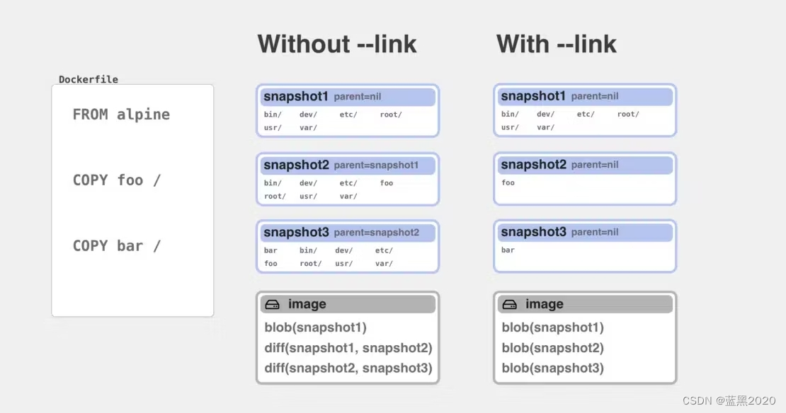

## 概述

`Dockerfile` 是一个文本文件，定义了构建镜像的步骤。文件默认名就是 Dockerfile ，使用默认名可以在 `docker build` 时不加参数。

## Dockerfile 语法

Dockerfile 的指令不区分大小写，但为了易于与参数区分，指令使用大写。Docker 按顺序运行 Dockerfile 中的指令，Dockerfile 以 `FROM` 指令开头，`FROM` 前只可能存在解析器指令、注释或全局参数。

- 注释和指令前的空格会被忽略，但不建议在行首使用空格。

常用指令
| 指令 | 描述 |
| --- | --- |
|`FROM <image>`| 定义了基础镜像 |
|`RUN <command>`| 镜像构建阶段执行命令 |
|`WORKDIR <directory>`| 为指令设置工作目录 |
|`COPY <src> <dest>`| 将构建上下文中的文件复制到容器指定路径中 |
|`CMD <command>`| 指定容器启动时默认执行的命令 |

示例：

```dockerfile
FROM node:18-alpine       # 基础镜像
WORKDIR /app              # 设置工作目录
COPY package*.json ./     # 复制依赖文件
RUN npm install           # 安装依赖
COPY . .                  # 复制项目文件
EXPOSE 3000               # 暴露端口
CMD ["npm", "start"]      # 容器启动命令
```

### 解析器指令

该指令是可选的，解析器指令不会在构建过程中添加层，也不会显示为构建步骤，其格式为 `directive=value`，是一种特殊的注释。

使用规则如下：

- 每种指令只能使用一次
- 不能换行
- 不能出现在注释行后面
- 写在行首
- 使用小写
- 不推荐指令前加空格

支持以下几种解析器指令：

`syntax`：
使用 `syntax` 声明 build 过程中使用的 Dockerfile 语法版本，否则 BuildKit 将使用内置解析器版本。使用该指令的好处是可以不更新 Docker 的前提下使用最新版本的语法特性。

```dockerfile
# syntax=docker/dockerfile:1
```

推荐使用以上指令，它告诉 BuildKit 始终拉取最新稳定的 Dockerfile 语法版本来执行构建。

`escape`：
`escape` 用于更改 Dockerfile 默认的转义字符，默认的转义字符是 `\`。转义字符可以转义一行中的字符和换行符。在 `RUN` 指令中，只有转义字符出现在行尾的时候，才会被解析器识别并转义换行符，行内的转义符会被直接传递给底层的 shell 解释。

```dockerfile
# escape=`
# 将转义符更改为反引号
```

`check`：
`check` 命令用于配置 [build checks](https://docs.docker.com/build/checks/)，默认执行所有构建检查，并且失败只会产生警告。使用 `#check=skip=<check-name>` 可跳过指定检查步骤，使用 `all` 禁用所有检查。使用 `#check=error=true`，可以将警告升级为错误，从而强制构建失败。

官方建议使用 `#error=true` 时，使用 `syntax` 固定 Dockerfile 语法版本，这样可以避免新版本加入新的检查时构建失败。

示例：

```dockerfile
# check=skip=JSONArgsRecommended,StageNameCasing;error=true
```

### .dockerignore file

使用 `.dockerignore` 可从构建上下文中排除文件和目录，这样做是为了减少构建上下文大小，避免不必要的文件被复制进镜像，缓存命中率更高。

### exec 格式和 shell 格式

RUN、CMD 和 ENTRYPOINT 指令均有两种执行形式：

1. exec 格式

```dockerfile
INSTRUCTION ["executable","param1","param2"]
```

exec 形式被解析为 JSON 数组，使用双引号包裹命令。

2. shell 格式

```dockerfile
INSTRUCTION command param1 param2
```

shell 形式更加宽松，强调易用性、灵活性和可读性。

对比：

| 特性          | Shell 格式                             | Exec 格式                                    |
| ------------- | -------------------------------------- | -------------------------------------------- |
| 语法          | `COMMAND command param1 param2`        | `COMMAND ["executable", "param1", "param2"]` |
| 执行方式      | 通过 Shell (`/bin/sh -c`) 执行命令     | 直接执行可执行文件                           |
| 环境变量      | 支持 `$VAR` 等环境变量替换             | 不支持环境变量替换                           |
| Shell 功能    | 支持管道 (`\|`), 重定向 (`>`), `&&` 等 | 不支持 Shell 特性，必须转义 `\`              |
| 进程 ID (PID) | 应用程序是 Shell 的子进程，PID > 1     | 应用程序直接以 PID 1 运行                    |
| 信号处理      | 可能会丢失信号，无法优雅停机           | 能正确接收并处理信号，利于优雅停机           |
| 安全性        | 存在命令注入风险                       | 更安全，没有 Shell 解析的风险                |
| 常见用法      | `RUN` 指令，用于组合复杂命令           | `CMD`, `ENTRYPOINT`，用于启动主应用          |
| 例子          | `CMD echo $HOME`                       | `CMD ["echo", "Hello, World!"]`              |

### `FROM`

FROM 指令用于初始化一个新的构建阶段，并为后续指令设置一个基础镜像。一个构建过程 ** 必须 ** 以 FROM 指令开头，本节开头说明了例外情况。

```dockerfile
FROM [--platform=<platform>] <image>[:<tag>] [AS <name>]
```

`<tag>` 默认为 `latest`，`<name>` 为新的构建阶段命名，后续步骤可引用在此阶段构建的镜像。

> 除了基于现有的镜像（如 Ubuntu 或 Alpine）构建之外，Docker 还有一个名为 scratch 的特殊 “镜像”。
> scratch 是一个虚拟的概念，它代表一个完全空白、不含任何文件系统的基础镜像。 使用 FROM scratch 就像是从一张白纸开始，不继承任何操作系统或依赖，只添加你自己的应用程序。它通常用于构建极度精简、高效且安全的静态编译程序镜像。

在 FROM 之前声明的 ARG 位于构建阶段之外，因此不能在 FROM 之后的任何指令中使用。要使用在第一个 FROM 之前声明的 ARG 的默认值，需在构建阶段内使用不带值的 ARG 指令，多个 FROM 无需重复声明：

```dockerfile
# RUN 想使用 ARG 参数的值必须声明
ARG VERSION=latest
FROM busybox:$VERSION
ARG VERSION
RUN echo $VERSION > image_version

# 无需重复声明
ARG  CODE_VERSION=latest
FROM base:${CODE_VERSION}
CMD  /code/run-app

FROM extras:${CODE_VERSION}
CMD  /code/run-extras
```

### `RUN`

RUN 指令会在当前镜像层之上新建一层，并在该层执行命令。命令执行完毕后，提交为一个新的镜像层，并用于 Dockerfile 的下一步骤。

**RUN 指令的缓存机制 **

默认情况下，RUN 指令的缓存不会自动失效。例如：

> 今天构建了一个镜像，并执行了 `RUN apt-get update`。明天再次执行 `docker build`，Docker 会发现这条指令没有变化，因此会跳过它，直接使用昨天的缓存层，即使今天 apt-get 可能会有新的包更新。

如何使缓存失效？

1. ** 使用 `--no-cache` 标志 **

- 在执行 `docker build` 时加上 `--no-cache` 标志，可以禁用整个构建过程的缓存。

2. ** 通过 ADD 或 COPY 指令使其失效 **

- Docker 的缓存机制是按顺序工作的。如果 Dockerfile 中前面的任何指令因为源文件发生变化而导致缓存失效，那么该指令之后的所有指令的缓存都会被认为是失效的，从而重新执行。因此，将 RUN 指令放在 ADD 或 COPY 之后（假设添加的文件会变化），就能使 RUN 层的缓存失效。

格式如下，通常使用 **shell** 格式：

```dockerfile
# Shell 格式
RUN [OPTIONS] <command> ...
# Exec 格式
RUN [OPTIONS] [ "<command>", ... ]
```

为了精简镜像的大小，在 RUN 指令中要尽量精简操作，以下是常用技巧：

1. 选择轻量基础镜像
2. 避免不必要的文件加入镜像
3. 避免安装不必要的依赖
4. 清理不必要的缓存和临时文件
5. 合并多个命令为一个 RUN
6. 多阶段构建

### `CMD`

CMD 指令是 Dockerfile 中用于定义容器启动时默认执行的命令。

格式如下，通常使用 exec 格式：

```dockerfile
# exec 格式，executable 的默认参数是 ENTRYPOINT
CMD ["executable","param1","param2"] (exec form)
# Shell 格式，会通过 bin/sh -c 执行命令
CMD command param1 param2 (shell form)
```

** 特性 **

- 一个 Dockerfile 中只能有一个 CMD 指令。如果出现多个，只有最后一个会生效。
- CMD 的核心目的是提供一个默认命令，这个默认命令可以被 `docker run` 命令行的参数覆盖。
- 与 ENTRYPOINT 的关系：
  - 如果 Dockerfile 中只有 CMD，那么它就是容器的启动命令。
  - 如果 ENTRYPOINT 和 CMD 都存在，ENTRYPOINT 定义了容器的主程序，而 CMD 提供了默认参数。这种组合是创建可扩展、易用容器的推荐方式。

### `LABEL`

LABEL 指令为镜像添加元数据，可以在一条指令中添加多个标签，用空格分隔。LABEL 具有继承性，如果基础镜像已经包含了一些标签，新镜像会继承这些标签。并且新值会覆盖旧值。

格式如下，如果 key 或 value 中包含空格，必须使用双引号将其包裹起来。

```dockerfile
LABEL <key>=<value> [<key>=<value>...]
```

查看标签：

```bash
docker image inspect --format='{{json .Config.Labels}}' myimage
```

### `EXPOSE`

EXPOSE 指令告诉 Docker 容器在运行时监听的端口。
格式

```dockerfile
# 默认协议是 TCP，同时暴露 TCP 和 UDP 端口需要用两条 EXPOSE 指令。
EXPOSE <port> [<port>/<protocol>...]
```

在创建容器时，使用 `-P` 标志会自动把 Dockerfile 里 EXPOSE 的端口映射到宿主机的随机高位端口，如果同时 `EXPOSE 80/tcp` 和 `EXPOSE 80/udp`，会各自映射一次，得到两个不同的宿主机端口。使用 `-p` 标志可以覆盖 EXPOSE 指令指定的端口号。

### `ENV`

`ENV` 用来设置环境变量，在构建和运行时都可用，新镜像会继承基础镜像设置的环境变量，同样可以覆盖旧值。

格式如下，如果值包含空格，用引号或反斜杠来处理。也可以在一条 ENV 指令中设置多个变量，用空格分隔：

```dockerfile
ENV <key>=<value> [<key>=<value>...]

ENV MY_NAME="John Doe"
ENV MY_DOG=Rex\ The\ Dog
```

环境变量可以在 Dockerfile 中使用，推荐语法格式为 `${variable_name}` 用大括号明确变量边界，避免出现歧义。

### `COPY`

COPY 命令用于将 <src> 的文件复制到 <dest> 中，可以从构建上下文、构建阶段、镜像中复制文件。

格式：

```dockerfile
COPY [OPTIONS] <src> ... <dest>
COPY [OPTIONS] ["<src>", ... "<dest>"]
```

COPY 只能访问构建上下文内的文件，错误使用 `/` 或 `../` 等超出上下文的操作会被 Docker 自动去除，不会跳出上下文。源路径中的尾部斜杠会被忽略。COPY 支持通配符，如 `ADD *.txt /dest/`。

高级选项：

`COPY --from`

格式：COPY [--from=<image|stage|context>] <src> ... <dest>

默认情况下，COPY 指令从构建上下文复制文件，使用 `COPY --from` 可以从镜像、构建阶段复制文件。

```dockerfile
# 从构建阶段复制
# syntax=docker/dockerfile:1
FROM alpine AS build
COPY . .
RUN apk add clang
RUN clang -o /hello hello.c

FROM scratch
COPY --from=build /hello /

# 从镜像复制
COPY --from=nginx:latest /etc/nginx/nginx.conf /nginx.conf
```

`COPY --chown` 和 `COPY --chmod`

--chown：为复制到镜像中的文件设置所有者和组。
--chmod：为复制到镜像中的文件设置权限。

格式：`COPY [--chown=<user>:<group>] [--chmod=<perms> ...] <src> ... <dest>`

```dockerfile
COPY --chown=lighthouse:commonuser ./myapp /usr/local/bin/myapp
COPY --chown=1001:1002 ./myapp /usr/local/bin/myapp
COPY --chmod=755 ./start.sh /usr/local/bin/start.sh
```

`COPY --link`

格式：`COPY [--link[=<boolean>]] <src> ... <dest>`

`COPY --link` 用于在镜像层内通过硬链接方式复制文件，避免冗余的数据写入。该指令仅适用于构建阶段，最终镜像仍为分层存储

使用 `--link` 时，Docker 并不会物理复制文件数据，而是在新 layer 内创建硬链接指向已有文件。这样可以显著减少构建时的磁盘占用和 I/O，但镜像分层机制本身不变。

优点：

- 更高的缓存命中率：即使前面层的指令发生了变化，只要 COPY 的源文件没有变，它的缓存仍然有效。特别适合多阶段构建，避免因前面微小改动而重新编译整个阶段。

- 更快的重新构建：在基础镜像更新时，Docker 可以智能地只重新构建 COPY 指令之后的层，而不需要重新处理之前的所有层。
- 节省磁盘空间：大文件场景下，硬链接能有效减少空间占用。

二者区别：



`COPY --parents` 和 `COPY --exclude`

尚未在正式版推出。

### `ADD`

ADD 指令用于将文件从 <src> 复制到 <dest> 中。它和 COPY 指令在功能上非常相似，但 ADD 具有一些额外的、更 “智能” 的特性。

格式：

```dockerfile
ADD [OPTIONS] <src> ... <dest>
ADD [OPTIONS] ["<src>", ... "<dest>"]
```

ADD 的用法与 COPY 相同，多了以下特性：

- 可以将 URL 或 Git 仓库的内容下载到 <dest>，从 URL 下载的默认权限是 600，从 Git 下载，普通文件的权限是 644，可执行文件的权限是 755.
- 可以自动解压源文件到目的地址，但是从 URL 下载的压缩包不会。

> 官方建议：能用 COPY 的地方就不要用 ADD，减少意外行为。

### `ENTRYPOINT`

`ENTRYPOINT` 定义了容器启动程序和参数。

格式

```dockerfile
ENTRYPOINT ["executable", "param1", "param2"]
ENTRYPOINT command param1 param2
```

当 ENTRYPOINT 使用 exec 格式时，`docker run` 命令后跟的任何参数，都会被直接追加到 ENTRYPOINT 的参数之后，并且会覆盖 CMD 定义的内容。

如果一个 dockerfile 中有多个 ENTRYPOINT，只有最后一条生效，可以使用 `-entrypoint` 覆盖 dockerfile 中的设置

ENTRYPOINT 指令用于配置一个容器，使其作为可执行程序运行。它定义了容器启动时要运行的主命令，而这个命令通常不应该被轻易覆盖。

ENTRYPOINT 的两种形式
与 CMD 类似，ENTRYPOINT 也有两种形式：

Exec 格式（推荐）：ENTRYPOINT ["executable", "param1", "param2"]

这是首选格式，它直接执行指定的程序，而不经过 Shell。

优点：容器的主进程（PID 1）就是你的应用程序，这使得它可以正确接收和处理来自 Docker 的信号（如 docker stop 发送的 SIGTERM）。

交互：通过这种格式，CMD 指令或 docker run 命令中提供的参数，都会作为参数追加到 ENTRYPOINT 定义的可执行程序之后。

Shell 格式：ENTRYPOINT command param1 param2

这种格式会通过 /bin/sh -c 执行命令。

缺点：你的应用程序不是 PID 1，而是 Shell 的一个子进程。这意味着它无法直接接收 Docker 发送的信号，导致 docker stop 可能会超时并强制终止容器。

交互：这种格式会忽略任何 CMD 或 docker run 提供的参数。

**ENTRYPOINT 与 CMD 的交互 **
ENTRYPOINT 和 CMD 共同定义了容器的启动行为，它们的关系是：

- ENTRYPOINT 定义主程序。
- CMD 定义默认参数。

这种组合可以提供灵活的默认参数，并且可以被 docker run 的参数覆盖。

举例：

```Dockerfile
FROM ubuntu
ENTRYPOINT ["/usr/bin/top", "-b"]
CMD ["-c"]
```

直接运行 docker run <image> 时，它会执行 `/usr/bin/top -b -c`。

运行 docker run <image> -d 时，CMD 的参数 -c 被覆盖，最终执行 `/usr/bin/top -b -d`。

### `VOLUME`

`VOLUME` 指令用于在 Dockerfile 中创建一个挂载点，并指定该目录作为数据卷存储位置。

格式：

```dockerfile
VOLUME ["/data"]
```

例子：

```dockerfile
FROM nginx:alpine
# 声明数据卷
VOLUME /usr/share/nginx/html
# 复制本地网站文件到容器
COPY ./my-website /usr/share/nginx/html
CMD ["nginx", "-g", "daemon off;"]
```

为了保证镜像的可移植性，Dockerfile 中的 VOLUME 不能绑定宿主机目录，只能声明容器内的数据卷路径。宿主机目录必须在容器创建或运行时指定。

### USER

格式：

```dockerfile
USER <user>[:<group>]
USER <UID>[:<GID>]
```

USER 指令用于设置 Dockerfile 中后续指令的默认用户和用户组，默认以 root 用户运行。

例子：

```dockerfile
# 使用 root 用户安装应用和依赖
FROM ubuntu:22.04
RUN apt-get update && apt-get install -y my-app

# 创建一个非特权用户
RUN groupadd -r mygroup && useradd -r -g mygroup myuser

# 切换到非特权用户
USER myuser

# 后续指令都将以 myuser 用户执行
RUN echo "Hello from myuser" > /home/myuser/greeting
CMD ["my-app"]
```

### WORKDIR

WORKDIR 指令用于在 Dockerfile 中设置工作目录，后续的指令都会在这个目录下执行，提供的路径如果不存在会自动创建。

格式：

```dockerfile
WORKDIR /path/to/workdir
```

WORKDIR 可以解析环境变量

```dockerfile
ENV DIRPATH=/path
WORKDIR $DIRPATH
```

### ARG

与 ENV 类似，ARG 指令也用于设置环境变量，但不会保留在最终的镜像中。Dockerfile 可以包含一个或多个 ARG 指令。

格式：

```dockerfile
ARG <name>[=<default value>] [<name>[=<default value>]...]
```

可以为 ARG 变量设置一个默认值。如果在构建时没有通过 `--build-arg` 传递值，就会使用默认值。

ARG 作用域从它被定义的行开始，直到当前构建阶段结束。ARG 会影响构建缓存。ARG 单独声明不会破坏缓存，但如果它被用在 RUN、ENV、COPY --from 等会影响镜像层的地方，就会触发 cache miss。ENV 如果引用了 ARG，那它会把 ARG 的值写进镜像，ARG 变了就触发缓存失效

Docker 有一些预定义的 ARG 变量，比如 HTTP_PROXY, https_proxy 等。这些变量无需在 Dockerfile 中显式声明即可使用。它们不会被记录在 docker history 中，有助于防止敏感信息泄露。

ARG 和 ENV 的区别：
| 特性 |ARG| ENV|
|---|---|---|
| 作用域 | 仅在构建时可用 | 构建时和运行时都可用 |
| 持久性 | 不保留在最终镜像中 | 会保留在最终镜像中 |
| 用途 | 配置构建过程，如版本号、代理等 | 配置容器运行时行为，如路径、端口等 |
| 优先级 |ENV 变量会覆盖同名的 ARG 变量 | docker run --env 会覆盖 ENV 值 |

### ONBUILD

ONBUILD 指令是一个特殊的 Dockerfile 指令，它用于在当前镜像中添加一个 ** 触发器 **。这个触发器并不会在当前的构建中执行，而是在这个镜像被用作另一个镜像的基础镜像时，才会自动执行。

作用与原理

ONBUILD 指令用于定义一组在基础镜像构建阶段不会立即执行的构建步骤。这些步骤通常依赖于下游项目提供的特定文件或配置（例如 package.json、requirements.txt、自定义配置文件等），因此会延迟到该镜像被用作其他镜像的基础镜像时再执行。

通过 ONBUILD 指令，镜像创建者可以将通用的构建流程（如复制依赖文件、安装依赖、构建项目等）预先封装为模板。当其他项目以该镜像作为 FROM 时，这些 ONBUILD 指令会自动注入到后续构建流程中，从而确保构建过程的一致性与标准化。

工作流程

1.  定义触发器：在你的 `Dockerfile` 中，使用 `ONBUILD` 指令。例如：`ONBUILD ADD . /app/src`。
2.  构建镜像：Docker 在构建时会识别 `ONBUILD`，并将它作为一个元数据存储在镜像中，而不会执行它。
3.  使用镜像：当另一个 `Dockerfile` 使用你的镜像作为基础时，Docker 会在处理 `FROM` 指令后，自动执行你的镜像中所有 `ONBUILD` 定义的触发器。
4.  清理：一旦 `ONBUILD` 触发器被执行，它们就会从新生成的镜像中被 ** 清除 **。这意味着，`ONBUILD` 的触发器不会被 “孙子” 级别的构建继承。

`ONBUILD` 的限制

- 不允许嵌套：不能使用 `ONBUILD ONBUILD` 这样嵌套指令。
- 不能触发特定指令：`ONBUILD` 不能触发 `FROM` 或 `MAINTAINER` 这两个指令。
- 来源限制：当使用 `ONBUILD COPY --from` 时，如果来源是一个构建阶段（stage），那个阶段必须定义在下游的 `Dockerfile` 中。

例子

为 Python 应用程序创建一个通用的基础镜像。每个应用程序都需要将源代码复制到 `/app/src` 目录并运行一个构建脚本。可以在你的基础镜像 `python-base` 中这样定义：

```dockerfile
FROM python:3.10-slim
WORKDIR /app
ONBUILD ADD . /app/src
ONBUILD RUN pip install -r /app/src/requirements.txt
```

当一个开发者使用你的镜像时，他们的 `Dockerfile` 可以很简单：

```dockerfile
FROM python-base
# 触发器会自动执行，将当前目录下的文件复制到 /app/src 并安装依赖
```

### STOPSIGNAL

格式：

```dockerfile
STOPSIGNAL signal
```

STOPSIGNAL 指令用于设置当容器需要停止时，Docker 客户端将向容器的主进程（PID 1）发送的系统信号。如果未定义，则默认为 `SIGTERM`。在 `docker run` 或 `docker create` 命令中，可以使用 --stop-signal 标志覆盖 Dockerfile 中定义的 STOPSIGNAL。

### HEALTHCHECK

HEALTHCHECK 指令用于告诉 Docker 如何检测容器的健康状态。在 Dockerfile 中定义一个命令，Docker 会定期运行这个命令来判断容器是否正常工作。HEALTHCHECK 命令的输出可以通过 docker inspect 查看。当容器的健康状态改变时，Docker 会生成一个 health_status 事件，方便外部监控和响应。

格式：

```dockerfile
# 设置检查容器健康状况的命令
HEALTHCHECK [OPTIONS] CMD command
# 禁用从基础镜像继承的健康检查命令
HEALTHCHECK NONE
```

一个具有 HEALTHCHECK 的容器，除了常规的 running 或 stopped 状态外，还会有一个独立的健康状态：

- starting：容器正在启动，健康检查正在进行中。
- healthy：健康检查命令返回退出码 0。
- unhealthy：健康检查命令连续失败次数达到 --retries 的值，或者返回退出码 1。

参数
| 参数名 | 默认值 | 描述 |
|---|---|---|
|--interval| 30s| 健康检查的间隔时间。|
|--timeout| 30s| 健康检查命令的超时时间。|
|--start-period| 0s| 容器启动的缓冲期，期间的检查失败不计入重试次数。|
|--start-interval| 5s| start-period 期间的检查间隔。|
|--retries| 3| 将容器标记为不健康前，允许的连续失败次数。|

例子：

```dockerfile
HEALTHCHECK --interval=5m --timeout=3s \
  CMD curl -f http://localhost/ || exit 1
```

一个 Dockerfile 中只能有一条 HEALTHCHECK 指令，如果有多条，只有最后一条会生效。

### SHELL

SHELL 指令用于覆盖 RUN、CMD 和 ENTRYPOINT 这三条指令的默认 shell，并且会影响其后所有 shell 形式的指令。Linux 的默认 shell 是 ["/bin/sh", "-c"]，Windows 的默认 shell 是 ["cmd", "/S", "/C"]。

格式：

```dockerfile
SHELL ["executable", "parameters"]
```

### Here-Documents

Here-Documents 是 Docker BuildKit 支持的一种特殊语法，允许在 RUN 或 COPY 中直接嵌入多行文本，便于批量写入文件。

格式：

```dockerfile
# 将多行内容作为标准输入传递给 RUN 命令。可指定解释器，否则默认由 shell 解释。
RUN <<EOT <interpreter>
# 将多行内容直接写入镜像中的目标文件。
COPY <<EOF <target>
```

变量替换与缩进

- 使用 EOT：内容中的环境变量会在构建阶段被替换为实际值。
- 使用 "EOT"：内容不会进行变量替换，原样写入。
- 使用 -EOT：允许内容缩进，去除前导 tab 空格，便于嵌套在 Dockerfile 结构中。

例：

```dockerfile
# syntax=docker/dockerfile:1
FROM debian
RUN <<EOT bash
  set -ex
  apt-get update
  apt-get install -y vim
EOT
```

```dockerfile
# syntax=docker/dockerfile:1
COPY <<EOF config.yaml
name: "my-app"
version: 1.0
database:
  host: localhost
  port: 5432
EOF
```
