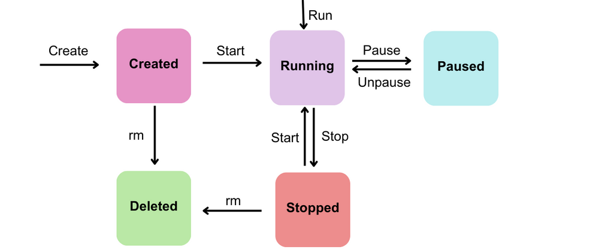

## 容器概述

Docker 容器是镜像的运行实例，包含了运行应用程序所需的所有组件。容器与宿主机和其他容器是隔离的，确保应用程序的一致性和安全性。

### 容器特性

- 轻量级：共享宿主机内核，启动速度快
- 隔离性：进程级隔离，互不干扰
- 可移植性：跨平台运行，环境一致
- 可扩展：易于水平扩展和集群部署

## 容器生命周期

### 容器的生命周期概述

一个 Docker 容器从创建到最终被移除，会经历一个完整的生命周期。这个周期可以分为五个阶段：创建、运行、暂停、停止和移除。



### 1. 创建

这是容器生命周期的起点。当你执行 `docker create` 命令时，Docker 会从镜像创建一个新容器，但不启动它。

创建容器时，Docker 守护进程会为容器创建一个只读的镜像层和一个可读写的容器层。

例子：

```bash
docker create nginx
```

命令会创建 nginx 容器，但它不会自动启动。

---

### 2. 运行

当容器被创建后，你可以通过 `docker start` 命令来启动它。更常见的做法是直接使用 `docker run` 命令，它会一步完成容器的创建和启动。一旦容器进入运行状态，它就会执行其指定的启动命令。

** 主要命令 **：`docker run` (创建并启动)、`docker start` (启动已创建的容器)

例子：

```bash
# 创建并启动一个容器
docker run -it alpine

# 启动之前已创建的容器
docker start nginx
```

### 3. 暂停

在容器运行期间，你可以使用 `docker pause` 命令来暂停它。这个操作会挂起容器中的所有进程，但容器本身仍然存在于内存中，只是所有 CPU 调度都被冻结了。

例子：

```bash
docker pause nginx
```

使用 `docker unpause` 命令来恢复容器的运行。

---

### 4. 停止

当容器中的主进程结束（正常退出或因错误退出），或者你手动执行 `docker stop` 命令时，容器会进入停止状态。

- `docker stop`：会向容器中的主进程发送 `SIGTERM` 信号，给它一个优雅关闭的机会。如果在超时时间内没有停止，Docker 会强制发送 `SIGKILL` 信号。
- 主进程退出：如果容器中的应用执行完毕（比如一个脚本），它会自然退出，容器也会随之进入停止状态。

例子：

```bash
docker stop nginx
```

### 5. 移除

这是容器生命周期的终点。一个已停止的容器仍然会占用磁盘空间。当你不再需要它时，可以使用 `docker rm` 命令来彻底移除它。

例子：

```bash
docker rm nginx
```

注意 ：`docker rm` 只能移除已停止的容器。如果你想强制删除一个正在运行的容器，可以使用 `docker rm -f`，但通常不推荐这么操作。

## 容器基本操作

### `docker run`

`docker run` 是 Docker 中最常用、也最强大的命令之一，它用于创建并启动一个新的容器。以下是它的核心参数：

| 指令        | 描述                                                                                 |
| :---------- | :----------------------------------------------------------------------------------- |
| `-d`        | 后台运行。让容器在后台运行，并打印容器 ID。                                          |
| `-i`        | 交互模式。保持 STDIN 开放，即使没有连接。通常与 `-t` 一起使用。                      |
| `-t`        | 分配一个伪终端。通常与 `-i` 一起使用，便于与容器进行交互。                           |
| `-p`        | 端口映射。将容器内的端口映射到主机上的端口。格式为主机端口: 容器端口。               |
| `-v`        | 数据卷。将主机上的目录或文件挂载到容器内，实现数据持久化。格式为主机路径: 容器路径。 |
| `--name`    | 指定容器名称。为容器指定一个可读的名称，便于管理。                                   |
| `--rm`      | 自动移除。容器退出后自动删除。常用于临时性、一次性任务的容器。                       |
| `--network` | 指定网络模式。将容器连接到指定的网络，默认为 `bridge`。                              |
| `--env`     | 设置环境变量。在容器内设置环境变量。可以简写为 `-e`。                                |

常用组合示例：

- 最基础的交互式运行：
  `docker run -it ubuntu /bin/bash`
  这会启动一个 `ubuntu` 容器并进入其命令行，你可以和它进行交互。

- 后台运行并映射端口：
  `docker run -d -p 8080:80 --name my-web-server nginx`
  这会启动一个名为 `my-web-server` 的 `nginx` 容器，在后台运行，并将主机的 `8080` 端口映射到容器的 `80` 端口。

### 容器管理命令

```bash
# 查看运行中的容器
docker ps

# 停止容器
docker stop <container_id>

# 启动已停止的容器
docker start <container_id>

# 重启容器
docker restart <container_id>

# 删除容器
docker rm <container_id>
```

## 容器配置

### 端口映射

```bash
# 映射单个端口
docker run -p 8080:80 nginx

# 映射多个端口
docker run -p 8080:80 -p 8443:443 nginx

# 映射 EXPOSE 暴露的端口
docker run -P nginx
```

### 环境变量

```bash
# 设置环境变量
docker run -e ENV_VAR=value nginx

# 从文件加载环境变量
docker run --env-file .env nginx
```

### 挂载目录

```bash
# 绑定挂载
docker run -v /host/path:/container/path nginx

# 命名卷挂载
docker run -v volume_name:/container/path nginx

# 只读挂载
docker run -v /host/path:/container/path:ro nginx
```

## 容器网络

### 网络模式

- bridge（默认）：容器连接到 docker0 网桥
- host：容器使用宿主机网络
- none：禁用网络
- 自定义网络：用户自定义的网络

```bash
# 创建自定义网络
docker network create my-network

# 连接容器到网络
docker run --network my-network nginx

# 查看网络列表
docker network ls
```

## 容器数据管理

### 数据卷类型

1. 匿名卷：由 Docker 自动创建和管理
2. 命名卷：用户指定名称，便于管理
3. 绑定挂载：将宿主机目录直接挂载到容器

```bash
# 创建数据卷
docker volume create my-volume

# 查看数据卷
docker volume ls

# 检查数据卷详情
docker volume inspect my-volume

# 删除数据卷
docker volume rm my-volume
```

## 容器重启策略

Docker 提供重启策略来控制容器退出时是否自动启动，或者 Docker 重启时是否自动启动。官方建议使用 --restart 控制容器启动，避免使用进程管理器启动容器。

| 策略                       | 描述                                         |
| -------------------------- | -------------------------------------------- |
| `no`                       | 不自动重启容器（默认）                       |
| `on-failure[:max-retries]` | 只在容器非正常退出时重启。可设置最大重试次数 |
| `always`                   | 容器总是重启，除非手动停止                   |
| `unless-stopped`           | 类似 always，但手动停止后不会自动重启        |

### 重启策略示例

```bash
# 设置重启策略
docker run --restart=always nginx

# 限制重启次数
docker run --restart=on-failure:3 nginx

# 更新现有容器的重启策略
docker update --restart=unless-stopped container_name

# 为所有运行容器设置重启策略
docker update --restart=unless-stopped $(docker ps -q)
```

## 容器日志管理

### 查看容器日志

```bash
# 查看容器日志
docker logs <container_id>

# 实时查看日志
docker logs -f <container_id>

# 查看最近的日志
docker logs --tail 100 <container_id>

# 带时间戳的日志
docker logs -t <container_id>
```

### 日志驱动配置

```bash
# 设置日志驱动
docker run --log-driver=json-file nginx

# 设置日志选项
docker run --log-driver=json-file --log-opt max-size=10m nginx
```

## 容器监控

### 容器状态监控

```bash
# 查看容器资源使用
docker stats

# 查看特定容器的资源使用
docker stats <container_id>

# 查看容器进程
docker top <container_id>

# 容器详细信息
docker inspect <container_id>
```

### 健康检查

```bash
# 在 Dockerfile 中定义健康检查
HEALTHCHECK --interval=30s --timeout=3s --retries=3 \
  CMD curl -f http://localhost/ || exit 1

# 运行时添加健康检查
docker run --health-cmd="curl -f http://localhost/" nginx
```

## 容器设计原则

- 一个容器一个服务：每个容器只运行一个主要服务
- 无状态设计：避免在容器内存储持久数据
- 最小权限原则：使用非 root 用户运行应用
